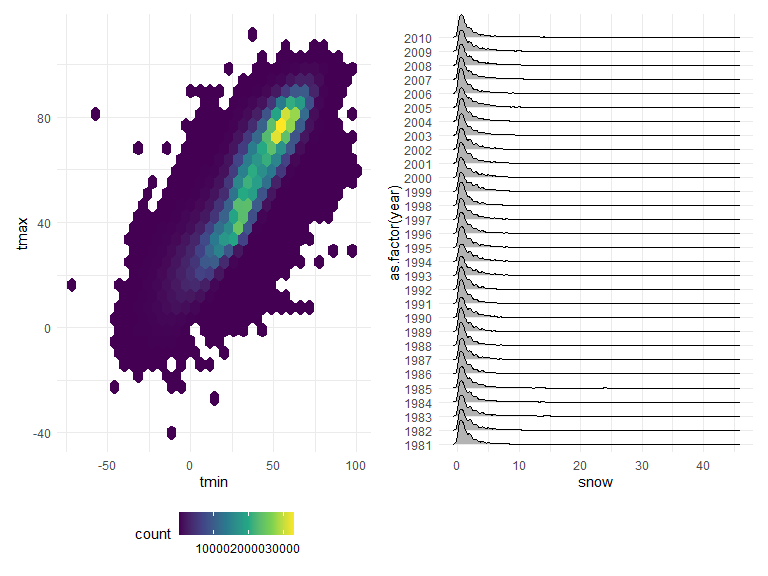
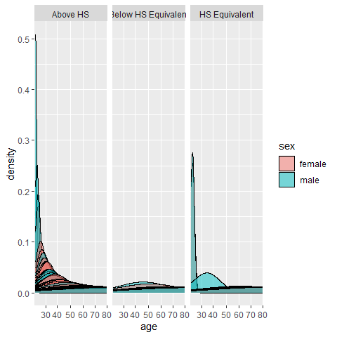
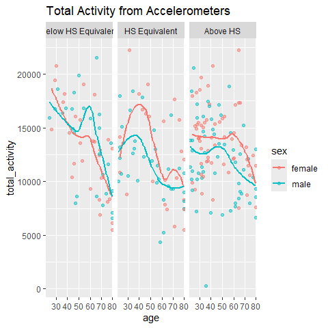
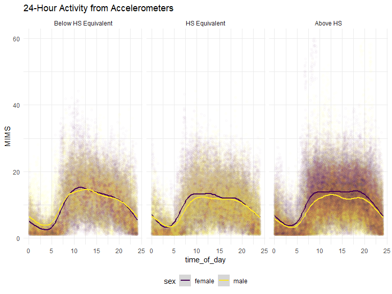
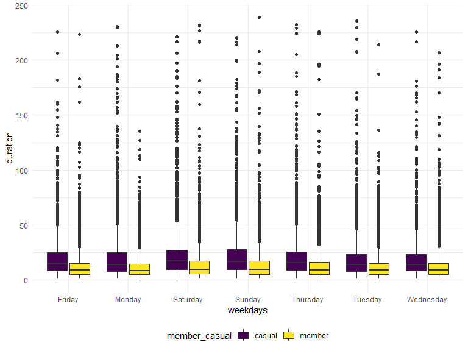

p8105_hw3_brm2150
================
Brooklynn McNeil
2024-10-07

## Problem 1

Clean the `ny_noaa` data by separating the variables for year, month,
and day. Ensure units for temp, precipitation, and snowfall. What is the
most commonly observed values for snowfall and why?

``` r
data("ny_noaa")

ny_noaa_clean = 
  ny_noaa |>
  filter(!if_any(prcp:tmin, is.na)) |>
  separate(date, into = c("year", "month", "day"), sep = "-") |>
  mutate(
    prcp = prcp/254, 
    snow = snow/25.4, 
    snwd = snwd/25.4,
    tmax = as.numeric(tmax),
    tmax = ((tmax*0.1*9/5) + 32),
    tmin = as.numeric(tmin),
    tmin = ((tmin*0.1*9/5) + 32)
    )
```

Below is a two-panel plot showing the average max temperature in January
and in July in each station across years.

``` r
hex = 
  ny_noaa_clean |> 
  ggplot(aes(x = tmin, y = tmax)) + 
  geom_hex()

ridge = 
  ny_noaa_clean |> 
  filter(snow < 100, snow > 0) |>
  ggplot(aes(x = snow, y = as.factor(year))) + 
  geom_density_ridges()

hex + ridge
```

    Picking joint bandwidth of 0.265

<!-- -->

## Problem 2

Import and tidy accelerometer data.

``` r
nhanes_accel = 
  read_csv("data/nhanes_accel.csv") |>
  janitor::clean_names()|>
  pivot_longer(
    cols = starts_with("min"),
    names_to = "minute",
    names_prefix = "min",
    values_to = "MIMS")
```

    Rows: 250 Columns: 1441
    ── Column specification ────────────────────────────────────────────────────────
    Delimiter: ","
    dbl (1441): SEQN, min1, min2, min3, min4, min5, min6, min7, min8, min9, min1...

    ℹ Use `spec()` to retrieve the full column specification for this data.
    ℹ Specify the column types or set `show_col_types = FALSE` to quiet this message.

``` r
nhanes_covar = 
  read_csv("data/nhanes_covar.csv", skip = 4) |>
  janitor::clean_names()
```

    Rows: 250 Columns: 5
    ── Column specification ────────────────────────────────────────────────────────
    Delimiter: ","
    dbl (5): SEQN, sex, age, BMI, education

    ℹ Use `spec()` to retrieve the full column specification for this data.
    ℹ Specify the column types or set `show_col_types = FALSE` to quiet this message.

``` r
nhanes_tidy = 
  left_join(nhanes_accel, nhanes_covar, by = "seqn")|>
  filter(age>=21)|>
  drop_na()|>
  mutate(
    sex = case_when(
     sex == 1 ~ "male",
      sex == 2 ~ "female"),
    sex = factor(sex),
    education = case_when(
      education == 1 ~ "Below HS Equivalent",
      education == 2 ~ "HS Equivalent",
      education == 3 ~ "Above HS"),
    education = factor(education),
    age = factor(age),
    seqn = factor(seqn)
     )
```

Reader friendly table for observing the number of men and women in each
education category.

``` r
nhanes_tidy|>
  group_by(sex, education) |>
  summarize(
    count = n()
  ) |>
  knitr::kable()
```

    `summarise()` has grouped output by 'sex'. You can override using the `.groups`
    argument.

| sex    | education           | count |
|:-------|:--------------------|------:|
| female | Above HS            | 84960 |
| female | Below HS Equivalent | 40320 |
| female | HS Equivalent       | 33120 |
| male   | Above HS            | 80640 |
| male   | Below HS Equivalent | 38880 |
| male   | HS Equivalent       | 50400 |

Create a visualization of the age distributions for men and women in
each educational category. Comment on these

``` r
nhanes_tidy |>
  distinct(seqn, .keep_all = TRUE) |>
  select(age, sex, education)|>
  ggplot(aes(x = age, fill = sex)) +
  geom_density(alpha = 0.5) +
  scale_x_discrete(breaks = c(20,30,40,50,60,70,80,90,100)) +
  facet_grid(~education)
```

<!-- -->

Here we analyze the activity data from the accelerometers. First, I
pivoted wider so that I could create a total activity variable. Below is
a plot comparing the total activity among the variables `age`, `sex`,
and `education`. From the plots below, we can see that women with at
least a high school education are more active than their male counter
parts at almost all ages. For people with high school equivalent
education, the activity peaks at age 40 for women and about 35 for men,
and then continues to decline as age increases.

``` r
nhanes_tidy |>
  pivot_wider(
    names_from = minute,
    values_from = MIMS,
    names_prefix = "min") |>
  mutate(total_activity = rowSums(across(.cols = c(min1:min1440))))|>
  relocate(seqn, sex,age,bmi,education,total_activity) |>
  ggplot(aes(x = age, y = total_activity, color = sex)) +
  geom_point(alpha = 0.5) + 
  geom_smooth(aes(group = sex), se = FALSE) +
  scale_x_discrete(breaks = c(20,30,40,50,60,70,80,90,100)) +
  facet_grid(~factor(education, levels = c("Below HS Equivalent","HS Equivalent", "Above HS"))) +
  labs(
    title = "Total Activity from Accelerometers"
  )
```

    `geom_smooth()` using method = 'loess' and formula = 'y ~ x'

<!-- -->
Make a graph with 3 panels to display 24-hour activity for each
educational level and color to indicate sex. Add smoothing trends I made
a three-panel plot to display the 24-hour data that was collected by the
accelerometers. From the plots below, we can tell that most people start
to get up and become active around and become less active around 7 or 8
o’clock. Again, the women with at least a high school degree show more
activity throughout the entire day than the men. Both sexs with less
than a High School education seem to have a peak activity around 10 in
the morning and then slowly decline activiity throughout the day.

``` r
nhanes_tidy |>
  mutate(time_of_day = as.numeric(minute)/60)|>
  ggplot(aes(x = time_of_day, y = MIMS, color = sex)) +
  geom_point(alpha = 0.01) +
  geom_smooth(aes(group = sex))+
  scale_y_continuous(limits = c(1,60))+
  facet_grid(~factor(education, levels = c("Below HS Equivalent","HS Equivalent", "Above HS"))) +
  labs(
    title = "24-Hour Activity from Accelerometers"
  )
```

    `geom_smooth()` using method = 'gam' and formula = 'y ~ s(x, bs = "cs")'

    Warning: Removed 57492 rows containing non-finite outside the scale range
    (`stat_smooth()`).

    Warning: Removed 57492 rows containing missing values or values outside the scale range
    (`geom_point()`).

<!-- -->

## Problem 3

Import and tidy citi bike data.

``` r
jan_2020 = 
  read_csv("data/citibike/Jan 2020 Citi.csv") |>
  mutate(month = "january",
         year = "2020")
```

    Rows: 12420 Columns: 7
    ── Column specification ────────────────────────────────────────────────────────
    Delimiter: ","
    chr (6): ride_id, rideable_type, weekdays, start_station_name, end_station_n...
    dbl (1): duration

    ℹ Use `spec()` to retrieve the full column specification for this data.
    ℹ Specify the column types or set `show_col_types = FALSE` to quiet this message.

``` r
jan_2024 = 
  read_csv("data/citibike/Jan 2024 Citi.csv")|>
  mutate(month = "january",
         year = "2024")
```

    Rows: 18861 Columns: 7
    ── Column specification ────────────────────────────────────────────────────────
    Delimiter: ","
    chr (6): ride_id, rideable_type, weekdays, start_station_name, end_station_n...
    dbl (1): duration

    ℹ Use `spec()` to retrieve the full column specification for this data.
    ℹ Specify the column types or set `show_col_types = FALSE` to quiet this message.

``` r
jul_2020 = 
  read_csv("data/citibike/July 2020 Citi.csv")|>
  mutate(month = "july",
         year = "2020")
```

    Rows: 21048 Columns: 7
    ── Column specification ────────────────────────────────────────────────────────
    Delimiter: ","
    chr (6): ride_id, rideable_type, weekdays, start_station_name, end_station_n...
    dbl (1): duration

    ℹ Use `spec()` to retrieve the full column specification for this data.
    ℹ Specify the column types or set `show_col_types = FALSE` to quiet this message.

``` r
jul_2024 = 
  read_csv("data/citibike/July 2024 Citi.csv")|>
  mutate(month = "july",
         year = "2024")
```

    Rows: 47156 Columns: 7
    ── Column specification ────────────────────────────────────────────────────────
    Delimiter: ","
    chr (6): ride_id, rideable_type, weekdays, start_station_name, end_station_n...
    dbl (1): duration

    ℹ Use `spec()` to retrieve the full column specification for this data.
    ℹ Specify the column types or set `show_col_types = FALSE` to quiet this message.

``` r
citi_bike_df = 
  bind_rows(jan_2020, jan_2024, jul_2020, jul_2024)
```

Describe the data

``` r
citi_bike_df |>
  group_by(duration, weekdays) |>
  summarize()
```

    `summarise()` has grouped output by 'duration'. You can override using the
    `.groups` argument.

    # A tibble: 99,144 × 2
    # Groups:   duration [97,274]
       duration weekdays 
          <dbl> <chr>    
     1     1.00 Monday   
     2     1.01 Wednesday
     3     1.01 Sunday   
     4     1.01 Monday   
     5     1.01 Thursday 
     6     1.01 Monday   
     7     1.01 Tuesday  
     8     1.01 Friday   
     9     1.01 Saturday 
    10     1.01 Monday   
    # ℹ 99,134 more rows

``` r
citi_bike_df |>
  ggplot(aes(x = weekdays, duration, fill = member_casual)) +
  geom_boxplot()
```

<!-- -->
