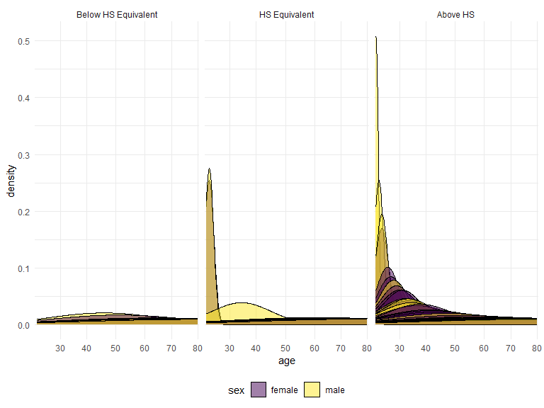
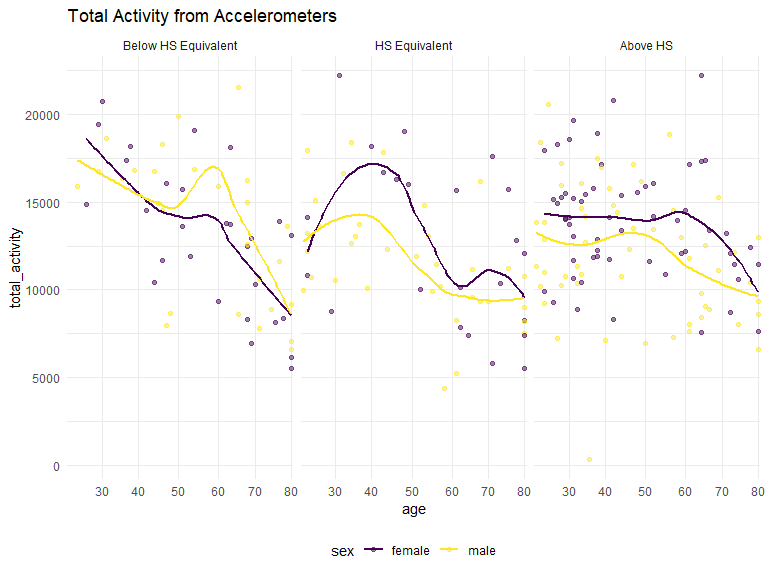
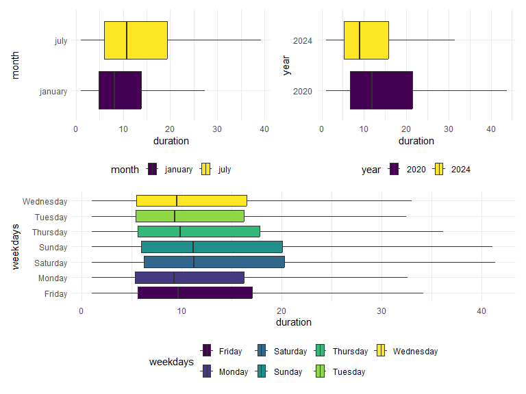
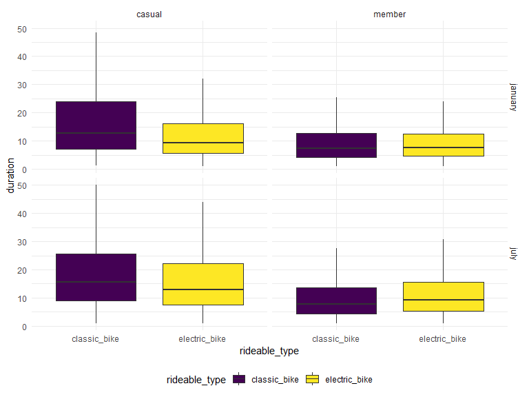

p8105_hw3_brm2150
================
Brooklynn McNeil
2024-10-07

## Problem 1

Clean the `ny_noaa` data by separating the variables for year, month,
and day. Ensure units for temp, precipitation, and snowfall. What is the
most commonly observed values for snowfall and why?

``` r
data("ny_noaa")

ny_noaa_clean = 
  ny_noaa |>
  filter(!if_any(prcp:tmin, is.na)) |>
  separate(date, into = c("year", "month", "day"), sep = "-") |>
  mutate(
    prcp = prcp/254, 
    snow = snow/25.4, 
    snwd = snwd/25.4,
    tmax = as.numeric(tmax),
    tmax = ((tmax*0.1*9/5) + 32),
    tmin = as.numeric(tmin),
    tmin = ((tmin*0.1*9/5) + 32)
    )
```

Below is a two-panel plot showing the average max temperature in January
and in July in each station across years.

``` r
hex = 
  ny_noaa_clean |> 
  ggplot(aes(x = tmin, y = tmax)) + 
  geom_hex()

ridge = 
  ny_noaa_clean |> 
  filter(snow < 100, snow > 0) |>
  ggplot(aes(x = snow, y = as.factor(year))) + 
  geom_density_ridges()

hex + ridge
```

    Picking joint bandwidth of 0.265


## Problem 2

Import and tidy accelerometer data.

``` r
nhanes_accel = 
  read_csv("data/nhanes_accel.csv") |>
  janitor::clean_names()|>
  pivot_longer(
    cols = starts_with("min"),
    names_to = "minute",
    names_prefix = "min",
    values_to = "MIMS")
```

    Rows: 250 Columns: 1441
    ── Column specification ────────────────────────────────────────────────────────
    Delimiter: ","
    dbl (1441): SEQN, min1, min2, min3, min4, min5, min6, min7, min8, min9, min1...

    ℹ Use `spec()` to retrieve the full column specification for this data.
    ℹ Specify the column types or set `show_col_types = FALSE` to quiet this message.

``` r
nhanes_covar = 
  read_csv("data/nhanes_covar.csv", skip = 4) |>
  janitor::clean_names()
```

    Rows: 250 Columns: 5
    ── Column specification ────────────────────────────────────────────────────────
    Delimiter: ","
    dbl (5): SEQN, sex, age, BMI, education

    ℹ Use `spec()` to retrieve the full column specification for this data.
    ℹ Specify the column types or set `show_col_types = FALSE` to quiet this message.

``` r
nhanes_tidy = 
  left_join(nhanes_accel, nhanes_covar, by = "seqn")|>
  filter(age>=21)|>
  drop_na()|>
  mutate(
    sex = case_when(
     sex == 1 ~ "male",
      sex == 2 ~ "female"),
    sex = factor(sex),
    education = case_when(
      education == 1 ~ "Below HS Equivalent",
      education == 2 ~ "HS Equivalent",
      education == 3 ~ "Above HS"),
    education = factor(education),
    age = factor(age),
    seqn = factor(seqn)
     )
```

Reader friendly table for observing the number of men and women in each
education category. Individuals with an above high school education for
both sexes are more active throughout the day. What is odd about the
data is that the group with the least amount of activity is females with
a high school education.

``` r
nhanes_tidy|>
  group_by(sex, education) |>
  summarize(
    count = n()
  ) |>
  arrange(group = desc(count)) |>
  knitr::kable()
```

    `summarise()` has grouped output by 'sex'. You can override using the `.groups`
    argument.

| sex    | education           | count |
|:-------|:--------------------|------:|
| female | Above HS            | 84960 |
| male   | Above HS            | 80640 |
| male   | HS Equivalent       | 50400 |
| female | Below HS Equivalent | 40320 |
| male   | Below HS Equivalent | 38880 |
| female | HS Equivalent       | 33120 |

``` r
nhanes_tidy |>
  distinct(seqn, .keep_all = TRUE) |>
  ggplot(aes(x = age, fill = sex)) +
  geom_density(alpha = 0.5) +
  scale_x_discrete(breaks = c(20,30,40,50,60,70,80,90,100)) +
    facet_grid(~factor(education, levels = c("Below HS Equivalent","HS Equivalent", "Above HS")))
```



Here we analyze the activity data from the accelerometers. First, I
pivoted wider so that I could create a total activity variable. Below is
a plot comparing the total activity among the variables `age`, `sex`,
and `education`. From the plots below, we can see that women with at
least a high school education are more active than their male counter
parts at almost all ages. For people with high school equivalent
education, the activity peaks at age 40 for women and about 35 for men,
and then continues to decline as age increases.

``` r
nhanes_tidy |>
  pivot_wider(
    names_from = minute,
    values_from = MIMS,
    names_prefix = "min") |>
  mutate(total_activity = rowSums(across(.cols = c(min1:min1440))))|>
  relocate(seqn, sex,age,bmi,education,total_activity) |>
  ggplot(aes(x = age, y = total_activity, color = sex)) +
  geom_point(alpha = 0.5) + 
  geom_smooth(aes(group = sex), se = FALSE) +
  scale_x_discrete(breaks = c(20,30,40,50,60,70,80,90,100)) +
  facet_grid(~factor(education, levels = c("Below HS Equivalent","HS Equivalent", "Above HS"))) +
  labs(
    title = "Total Activity from Accelerometers"
  )
```

    `geom_smooth()` using method = 'loess' and formula = 'y ~ x'


Make a graph with 3 panels to display 24-hour activity for each
educational level and color to indicate sex. Add smoothing trends I made
a three-panel plot to display the 24-hour data that was collected by the
accelerometers. From the plots below, we can tell that most people start
to get up and become active around and become less active around 7 or 8
o’clock. Again, the women with at least a high school degree show more
activity throughout the entire day than the men. Both sexs with less
than a High School education seem to have a peak activity around 10 in
the morning and then slowly decline activiity throughout the day.

``` r
nhanes_tidy |>
  mutate(time_of_day = as.numeric(minute)/60)|>
  ggplot(aes(x = time_of_day, y = MIMS, color = sex)) +
  geom_point(alpha = 0.01) +
  geom_smooth(aes(group = sex))+
  scale_y_continuous(limits = c(1,60))+
  facet_grid(~factor(education, levels = c("Below HS Equivalent","HS Equivalent", "Above HS"))) +
  labs(
    title = "24-Hour Activity from Accelerometers"
  )
```

    `geom_smooth()` using method = 'gam' and formula = 'y ~ s(x, bs = "cs")'

    Warning: Removed 57492 rows containing non-finite outside the scale range
    (`stat_smooth()`).

    Warning: Removed 57492 rows containing missing values or values outside the scale range
    (`geom_point()`).


## Problem 3

Import and tidy citi bike data.

``` r
jan_2020 = 
  read_csv("data/citibike/Jan 2020 Citi.csv") |>
  mutate(month = "january",
         year = "2020")
```

    Rows: 12420 Columns: 7
    ── Column specification ────────────────────────────────────────────────────────
    Delimiter: ","
    chr (6): ride_id, rideable_type, weekdays, start_station_name, end_station_n...
    dbl (1): duration

    ℹ Use `spec()` to retrieve the full column specification for this data.
    ℹ Specify the column types or set `show_col_types = FALSE` to quiet this message.

``` r
jan_2024 = 
  read_csv("data/citibike/Jan 2024 Citi.csv")|>
  mutate(month = "january",
         year = "2024")
```

    Rows: 18861 Columns: 7
    ── Column specification ────────────────────────────────────────────────────────
    Delimiter: ","
    chr (6): ride_id, rideable_type, weekdays, start_station_name, end_station_n...
    dbl (1): duration

    ℹ Use `spec()` to retrieve the full column specification for this data.
    ℹ Specify the column types or set `show_col_types = FALSE` to quiet this message.

``` r
jul_2020 = 
  read_csv("data/citibike/July 2020 Citi.csv")|>
  mutate(month = "july",
         year = "2020")
```

    Rows: 21048 Columns: 7
    ── Column specification ────────────────────────────────────────────────────────
    Delimiter: ","
    chr (6): ride_id, rideable_type, weekdays, start_station_name, end_station_n...
    dbl (1): duration

    ℹ Use `spec()` to retrieve the full column specification for this data.
    ℹ Specify the column types or set `show_col_types = FALSE` to quiet this message.

``` r
jul_2024 = 
  read_csv("data/citibike/July 2024 Citi.csv")|>
  mutate(month = "july",
         year = "2024")
```

    Rows: 47156 Columns: 7
    ── Column specification ────────────────────────────────────────────────────────
    Delimiter: ","
    chr (6): ride_id, rideable_type, weekdays, start_station_name, end_station_n...
    dbl (1): duration

    ℹ Use `spec()` to retrieve the full column specification for this data.
    ℹ Specify the column types or set `show_col_types = FALSE` to quiet this message.

``` r
citi_bike_df = 
  bind_rows(jan_2020, jan_2024, jul_2020, jul_2024)
```

Below is a table counting the number of rides that casual riders and
members take in the months of January and July and the years 2020 and
2024.The table reflects that citi bike members clearly ride more often
than casual riders. It also shows that Citi bike has been getting more
popular overtime as well as being more popular in July than in Janurary.

``` r
citi_bike_df |>
  group_by(month, year, member_casual) |>
  summarize(count = n()) |>
  arrange(count)|>
  knitr::kable()
```

    `summarise()` has grouped output by 'month', 'year'. You can override using the
    `.groups` argument.

| month   | year | member_casual | count |
|:--------|:-----|:--------------|------:|
| january | 2020 | casual        |   984 |
| january | 2024 | casual        |  2108 |
| july    | 2020 | casual        |  5637 |
| july    | 2024 | casual        | 10894 |
| january | 2020 | member        | 11436 |
| july    | 2020 | member        | 15411 |
| january | 2024 | member        | 16753 |
| july    | 2024 | member        | 36262 |

Below is a table of the most popular stations to start a ride in July
2024.

``` r
citi_bike_df |>
  filter(month == "july", year == 2024) |>
  group_by(month, year, start_station_name) |>
  summarize(count = n()) |>
  arrange(desc(count)) |>
  slice(1:5) |>
  knitr::kable(label = "Top 5 Start Station in July 2024")
```

    `summarise()` has grouped output by 'month', 'year'. You can override using the
    `.groups` argument.

| month | year | start_station_name       | count |
|:------|:-----|:-------------------------|------:|
| july  | 2024 | Pier 61 at Chelsea Piers |   163 |
| july  | 2024 | University Pl & E 14 St  |   155 |
| july  | 2024 | W 21 St & 6 Ave          |   152 |
| july  | 2024 | West St & Chambers St    |   150 |
| july  | 2024 | W 31 St & 7 Ave          |   146 |

Day of the week, month and year are being investigated for their effect
on median ride duration. The data is very skewed, so I removed outliers
from the boxplot. Rides that occur in July tend to be longer than those
in January. Interestingly, ride duration has decreased from 2020 to
2024. Not so suprisngly, the ride duration is longer on Saturdays and
Sunday. Looks like people are enjoying their weekend rides!

``` r
weekday = 
  citi_bike_df |>
  ggplot(aes(x = duration, y = weekdays, fill = weekdays)) +
  geom_boxplot(outliers = FALSE)

month = 
  citi_bike_df |>
  ggplot(aes(x = duration, y = month, fill = month)) +
  geom_boxplot(outliers = FALSE)

year= 
  citi_bike_df |>
  ggplot(aes(x = duration, y = year, fill = year)) +
  geom_boxplot(outliers = FALSE)

(month + year)/weekday
```



For data in 2024, make a figure that shows the impact of month,
membership status, and bike type on the distribution of ride duration.
Comment on your results.

The data from 2024 includes more information from the electric bikes.
The boxplots below show that the median ride duration is much more
affected by the bike type when it is a casual ride and not one from a
member.

``` r
citi_bike_df |>
  filter(year == 2024)|>
  ggplot(aes(x = rideable_type, y = duration, fill = rideable_type)) +
  geom_boxplot(outliers = FALSE)+
  facet_grid(~month ~member_casual)
```


